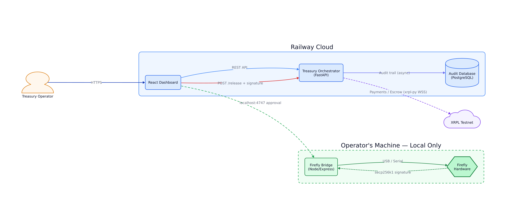
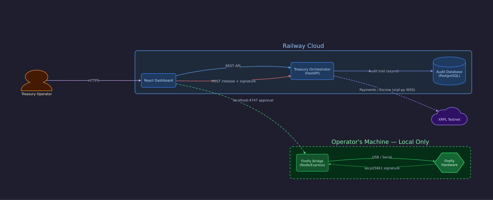
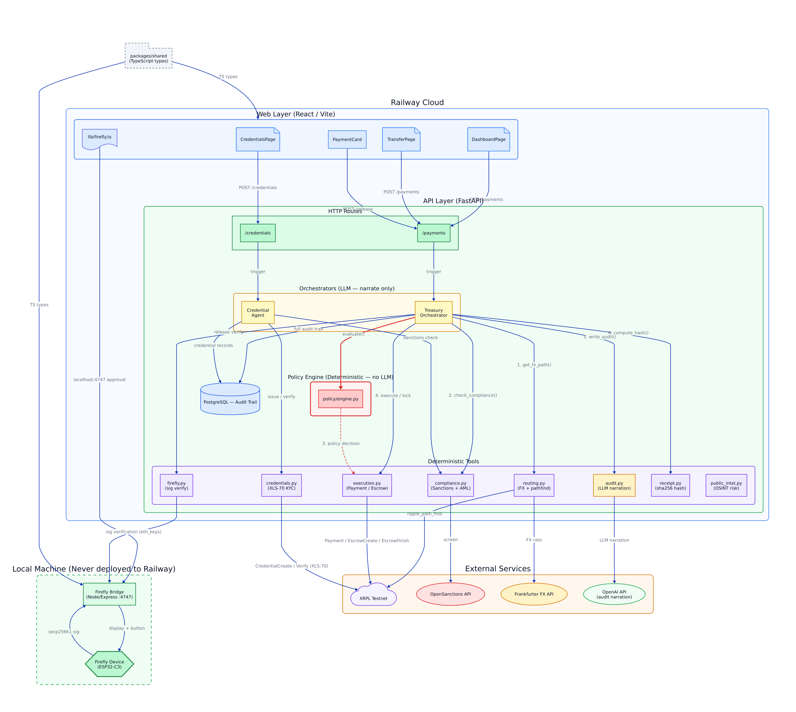
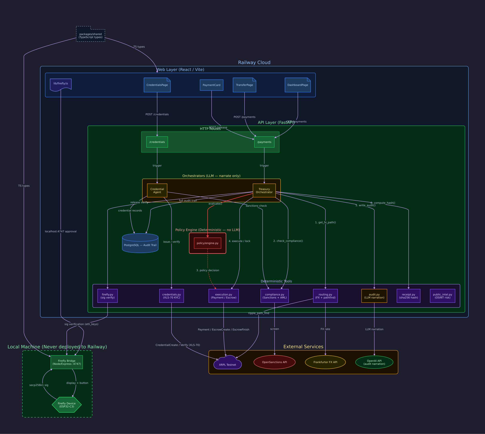
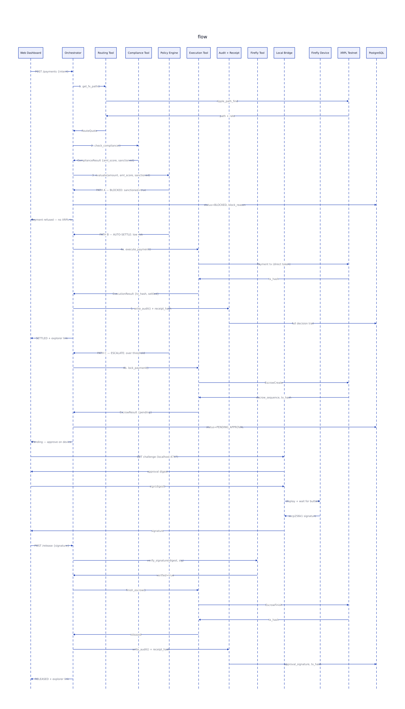
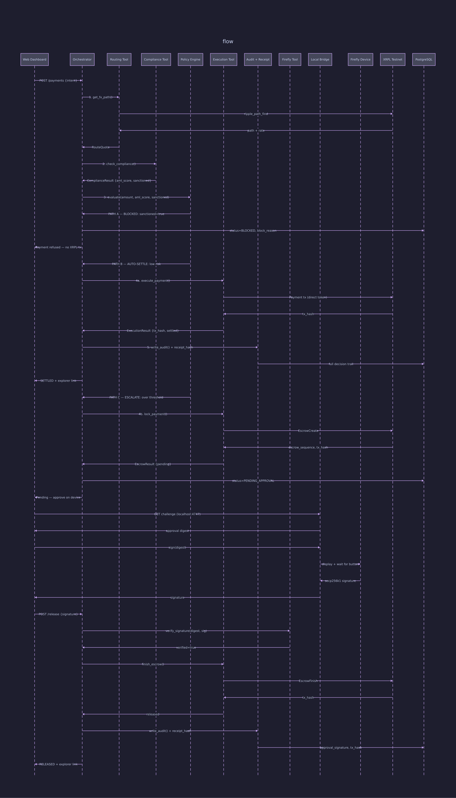

# Architecture Diagrams

Generated with [D2](https://d2lang.com/) — edit the `.d2` source files and re-render with `d2 <file>.d2 <file>.svg`.

## Diagrams

### 1. System Overview (Simplified)

High-level view: all deployed services, the local Firefly bridge, and external dependencies.

| Light | Dark |
|-------|------|
|  |  |

**Key boundaries:**
- **Railway Cloud** — API + Web Dashboard + PostgreSQL (deployed, public)
- **Local Machine** — Firefly Bridge + Hardware (never deployed; operator's machine only)
- **XRPL Testnet** — target ledger for all transactions

---

### 2. Detailed Component Architecture

Every component inside the API, their call order, and connections to external services.

| Light | Dark |
|-------|------|
|  |  |

**Colour coding:**
- 🟡 **Yellow** — LLM orchestrators (narrate only, never decide money)
- 🔴 **Red** — Policy Engine (deterministic boundary, never LLM)
- 🟣 **Purple** — Deterministic tools (routing, compliance, execution, firefly, receipt)
- 🔵 **Blue** — Web / HTTP layer
- 🟢 **Green** — Local Firefly hardware bridge

---

### 3. Payment Workflow (Sequence Diagram)

All three payment paths through the system.

| Light | Dark |
|-------|------|
|  |  |

**Three terminal states:**
- **BLOCKED** — Sanctioned counterparty; no XRPL transaction, no hardware override possible
- **SETTLED** — Auto-approved (amount ≤ $10k, AML score ≤ 60); direct Payment tx
- **RELEASED** — Escalated (amount > $10k or AML > 60); EscrowCreate → hardware sign → EscrowFinish

---

## Re-rendering

```bash
# Install D2 (if not present)
go install oss.terrastruct.com/d2@latest

# Render a single diagram
d2 diagrams/architecture-simplified-light.d2 diagrams/architecture-simplified-light.svg

# Render all
cd diagrams && for f in *.d2; do d2 "$f" "${f%.d2}.svg"; done
```

## Source files

| File | Description |
|------|-------------|
| `architecture-simplified-light.d2` | System overview, light theme |
| `architecture-simplified-dark.d2` | System overview, dark theme |
| `architecture-detailed-light.d2` | Full component breakdown, light theme |
| `architecture-detailed-dark.d2` | Full component breakdown, dark theme |
| `payment-flow-light.d2` | Payment sequence diagram, light theme |
| `payment-flow-dark.d2` | Payment sequence diagram, dark theme |
